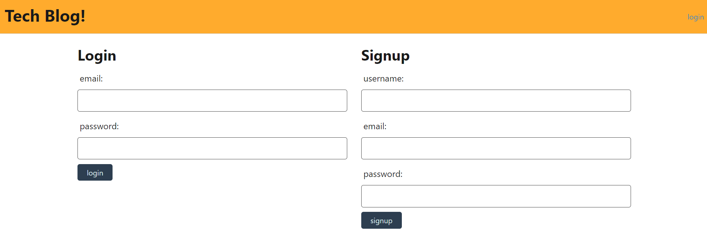
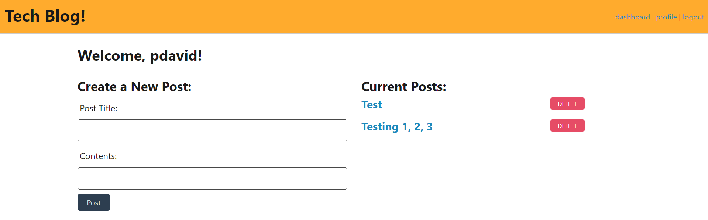
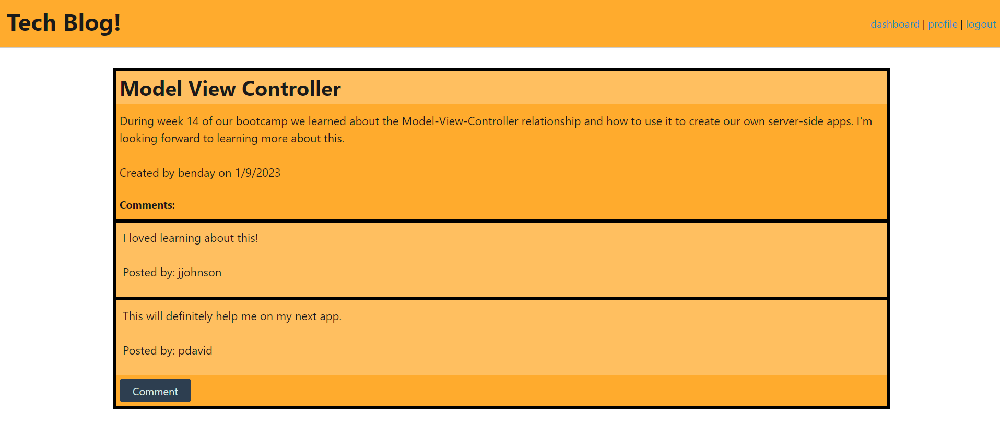

# Tech Blog - Model View Controller

  

## Description
  
  This application allows the user to create a blog post and comment on other user's posts by utilizing the Model-View-Controller method. 
  
  
## Table of Contents
  
- [Tech Blog - Model View Controller](#tech-blog---model-view-controller)
  - [Description](#description)
  - [Table of Contents](#table-of-contents)
  - [Installation](#installation)
  - [Usage](#usage)
  - [Credits](#credits)
  - [License](#license)
  - [How to Contribute](#how-to-contribute)
  - [Tests](#tests)
  - [Questions](#questions)
  - [Deployed Application:](#deployed-application)
  
  
## Installation
  
  To install this app, clone this repo and install the dependencies through the terminal. 
  
  
## Usage
  
  To use this app, click on the deployed application link (https://tech-blog-week-14-challenge.herokuapp.com/), then follow the instructions to create a new account or login to an existing one. You may then create a new post, comment on other posts, or delete your own posts. 

  
  
  
      
  
## Credits
  
  N/A
  
  
## License
  
  This software is licensed under the MIT license.
  
  ---
  
  
## How to Contribute
  
  N/A
  
  
## Tests
  
  N/A
  
  
## Questions
  
  Please forward any and all questions to benjaminmichaelday@gmail.com
  
  GitHub username: benmday

## Deployed Application:

  https://tech-blog-week-14-challenge.herokuapp.com/